# 🏗️ Architecture AdaptIQ - Documentation Complète

> **Dernière mise à jour:** 2025-10-26
> **Version:** 0.12.8
> **Auteur:** Analyse automatisée du projet

---

## 📑 Table des Matières

1. [Architecture Globale](#1-architecture-globale)
2. [Points d'Entrée Principaux](#2-points-dentrée-principaux)
3. [Flow de Données (Pipeline Complet)](#3-flow-de-données-pipeline-complet)
4. [Dépendances Critiques](#4-dépendances-critiques)
5. [Zones à Risque](#5-zones-à-risque-code-complexecouplé)
6. [Diagrammes Mermaid](#6-diagrammes-mermaid-détaillés)

---

## 1. Architecture Globale

### 1.1 Vue d'Ensemble du Système

```mermaid
graph TB
    subgraph "🎯 Entry Points"
        CLI[CLI - adaptiq init/validate]
        Template[Template Projects]
        Decorator[@crew_instrumental decorators]
    end

    subgraph "⚙️ Core System"
        Config[BaseConfig<br/>Shared Configuration]
        PreRun[PreRunPipeline<br/>Offline Learning]
        Run[AdaptiqRun<br/>Orchestrator]
        PostRun[PostRunPipeline<br/>Reconciliation]
    end

    subgraph "🧠 Q-Learning Engine"
        QTable[QTableManager<br/>Q-Learning Algorithm]
        StateMapper[StateMapper<br/>Semantic Matching]
        Rewards[Reward Calculator<br/>Multi-factor Scoring]
    end

    subgraph "🔌 Integrations"
        CrewAI[CrewAI Framework]
        LangChain[LangChain LLMs]
        OpenAI[OpenAI API<br/>GPT-4 + Embeddings]
    end

    subgraph "📊 Monitoring"
        Logger[AdaptiqLogger<br/>Centralized Logging]
        Metrics[TokenTracker<br/>Metrics Collection]
        Reports[ReportBuilder<br/>Aggregation]
    end

    CLI --> Config
    Template --> Decorator
    Decorator --> Run

    Config --> PreRun
    Config --> PostRun

    Run --> PreRun
    Run --> CrewAI
    Run --> PostRun

    PreRun --> QTable
    PostRun --> QTable
    PostRun --> StateMapper

    QTable --> Rewards
    StateMapper --> OpenAI

    CrewAI --> Logger
    PreRun --> LangChain
    PostRun --> LangChain

    Logger --> Metrics
    Metrics --> Reports

    style CLI fill:#e1f5ff
    style QTable fill:#fff3e0
    style Logger fill:#f3e5f5
```

### 1.2 Structure des Répertoires

```
adaptiq/
├── src/adaptiq/
│   ├── cli.py                          # Point d'entrée CLI
│   ├── agents/crew_ai/                 # Intégration CrewAI
│   │   ├── crew_config.py              # Configuration CrewAI
│   │   ├── crew_logger.py              # Capture d'exécution
│   │   ├── crew_log_parser.py          # Parsing des logs
│   │   ├── crew_prompt_parser.py       # Parsing de prompts
│   │   └── instrumental.py             # Orchestration par décorateurs
│   │
│   ├── core/
│   │   ├── abstract/                   # Classes abstraites (ABC)
│   │   │   ├── integrations/
│   │   │   │   ├── base_config.py      # Gestion config abstraite
│   │   │   │   ├── base_log_parser.py  # Parsing logs abstrait
│   │   │   │   └── base_prompt_parser.py
│   │   │   ├── pipelines/
│   │   │   │   ├── base_pre_run.py     # Pre-run abstrait
│   │   │   │   └── base_post_run.py    # Post-run abstrait
│   │   │   └── q_table/
│   │   │       ├── base_q_table_manager.py
│   │   │       └── base_state_mapper.py
│   │   │
│   │   ├── entities/                   # Modèles Pydantic
│   │   │   ├── adaptiq_config.py       # Configuration principale
│   │   │   ├── adaptiq_logs.py         # Logs structurés
│   │   │   ├── adaptiq_parsers.py      # Résultats de parsing
│   │   │   ├── adaptiq_rewards.py      # Système de récompenses
│   │   │   ├── adaptiq_meterics.py     # Métriques & tokens
│   │   │   └── q_table.py              # Structures Q-learning
│   │   │
│   │   ├── pipelines/
│   │   │   ├── run.py                  # Orchestrateur principal
│   │   │   ├── pre_run/
│   │   │   │   ├── pre_run.py          # Pipeline pré-exécution
│   │   │   │   └── tools/              # Outils de génération
│   │   │   └── post_run/
│   │   │       ├── post_run.py         # Pipeline post-exécution
│   │   │       └── tools/              # Outils de réconciliation
│   │   │
│   │   ├── q_table/
│   │   │   ├── q_table_manager.py      # Algorithme Q-learning
│   │   │   └── state_mapper.py         # Matching sémantique
│   │   │
│   │   └── reporting/
│   │       ├── aggregation/
│   │       │   └── aggregator.py       # Agrégation résultats
│   │       └── monitoring/
│   │           ├── adaptiq_logger.py   # Logger centralisé
│   │           └── adaptiq_metrics.py  # Tracking métriques
│   │
│   └── templates/crew_template/        # Template de projet
│
├── examples/prompt_engineer_agent/     # Exemple d'utilisation
└── pyproject.toml                      # Dépendances
```

---

## 2. Points d'Entrée Principaux

### 2.1 CLI Entry Point

**Fichier:** [src/adaptiq/cli.py](src/adaptiq/cli.py#L67-L154)

```python
# Défini dans pyproject.toml
[project.scripts]
adaptiq = "adaptiq.cli:main"
```

**Commandes disponibles:**

```bash
# Initialiser un nouveau projet
adaptiq init --name mon_projet --template crew-ai --path ./

# Valider une configuration
adaptiq validate --config_path ./config/adaptiq_config.yml --template crew-ai
```

**Diagramme de flux CLI:**

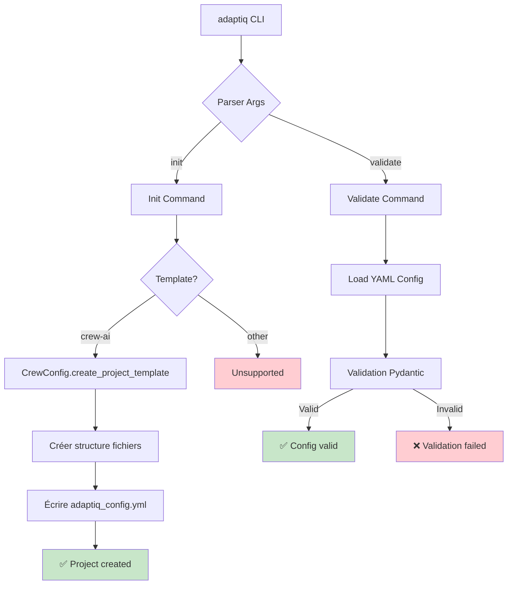

### 2.2 Decorator Entry Point (CrewAI Integration)

**Fichier:** [src/adaptiq/agents/crew_ai/instrumental.py](src/adaptiq/agents/crew_ai/instrumental.py#L72-L113)

**Pattern d'utilisation:**

```python
from adaptiq.agents.crew_ai import crew_instrumental

# Dans votre main.py
@crew_instrumental.crew_logger(log_to_console=True)
def run():
    crew_instance = MyCrew().crew()
    result = crew_instance.kickoff()
    result._crew_instance = crew_instance  # IMPORTANT!
    return result

@crew_instrumental.run(config_path="./config/adaptiq_config.yml")
def main():
    run()

if __name__ == "__main__":
    main()
```

**Ordre d'exécution des décorateurs:**

```mermaid
sequenceDiagram
    participant User
    participant @run
    participant @crew_logger
    participant AdaptiqRun
    participant CrewAI
    participant PreRun
    participant PostRun

    User->>@run: main()
    @run->>AdaptiqRun: init_run(func)
    AdaptiqRun->>PreRun: execute_pre_run_pipeline()
    PreRun-->>AdaptiqRun: new_prompt
    AdaptiqRun->>AdaptiqRun: update_prompt(new_prompt)

    AdaptiqRun->>@crew_logger: func()
    @crew_logger->>CrewAI: kickoff()
    CrewAI->>CrewAI: Execute agents
    CrewAI-->>@crew_logger: result + logs
    @crew_logger-->>AdaptiqRun: result

    AdaptiqRun->>PostRun: execute_post_run_pipeline()
    PostRun-->>AdaptiqRun: reconciliation_results
    AdaptiqRun->>AdaptiqRun: update_prompt(new_prompt)

    AdaptiqRun-->>@run: final_result
    @run-->>User: final_result
```

### 2.3 Template Entry Point

**Fichier:** [src/adaptiq/templates/crew_template/main.py](src/adaptiq/templates/crew_template/main.py)

Fourni comme point de départ pour les nouveaux projets.

---

## 3. Flow de Données (Pipeline Complet)

### 3.1 Vue d'Ensemble des 3 Phases

```mermaid
graph LR
    subgraph "📋 Phase 1: PRE-RUN"
        A1[Prompt Original]
        A2[Parse Prompt]
        A3[Generate States]
        A4[Simulate Scenarios]
        A5[Warm Q-Table]
        A6[Optimize Prompt v1]
    end

    subgraph "🚀 Phase 2: RUN"
        B1[Execute Agent]
        B2[Capture Logs]
        B3[Track Metrics]
    end

    subgraph "🔄 Phase 3: POST-RUN"
        C1[Parse Logs]
        C2[Match States]
        C3[Update Q-Table]
        C4[Optimize Prompt v2]
        C5[Generate Report]
    end

    A1 --> A2 --> A3 --> A4 --> A5 --> A6
    A6 --> B1
    B1 --> B2 --> B3
    B3 --> C1 --> C2 --> C3 --> C4 --> C5

    C5 -.Next Iteration.-> A1

    style A6 fill:#fff3e0
    style B1 fill:#e1f5ff
    style C4 fill:#f3e5f5
```

### 3.2 Phase 1: Pre-Run Pipeline (Offline Learning)

**Fichier:** [src/adaptiq/core/pipelines/pre_run/pre_run.py](src/adaptiq/core/pipelines/pre_run/pre_run.py#L33-L558)

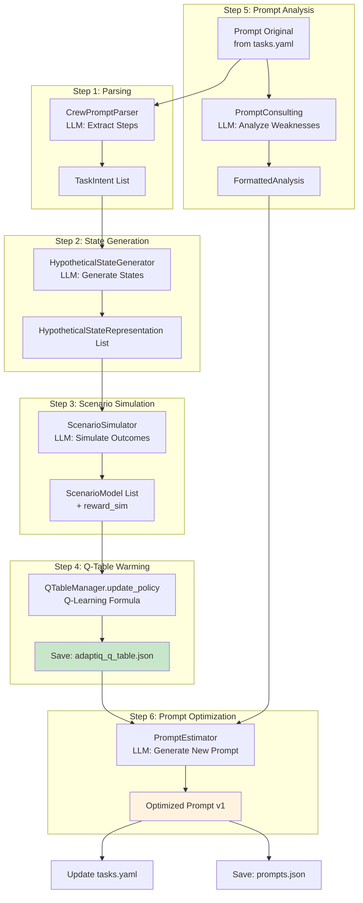

**Détails des Étapes:**

#### 1. Prompt Parsing

**Outil:** `CrewPromptParser` ([crew_prompt_parser.py](src/adaptiq/agents/crew_ai/crew_prompt_parser.py))

**Input:**
```yaml
# tasks.yaml
task_name:
  description: "Analyze the company data and send a personalized email to the lead."
  expected_output: "Email content with company insights"
```

**Process:**
- Appel LLM avec template XML
- Parse la réponse XML
- Extract steps (intended_subtask, intended_action, expected_outcome)

**Output:**
```python
[
  TaskIntent(
    intended_subtask="InformationRetrieval_Company",
    intended_action="FileReadTool",
    expected_outcome="Company data retrieved",
    ...
  ),
  TaskIntent(
    intended_subtask="ActionExecution_SendEmail",
    intended_action="SendEmailTool",
    expected_outcome="Email sent successfully",
    ...
  )
]
```

#### 2. Hypothetical State Generation

**Outil:** `HypotheticalStateGenerator` ([hypothetical_state_generator.py](src/adaptiq/core/pipelines/pre_run/tools/hypothetical_state_generator.py))

**Process:**
- Pour chaque TaskIntent, générer un état idéal
- Appel LLM pour créer state-action pairs

**Output:**
```python
[
  HypotheticalStateRepresentation(
    state_before=QTableState(
      current_subtask="InformationRetrieval_Company",
      last_action_taken="None",
      last_outcome="None",
      key_context="company info"
    ),
    intended_action=QTableAction(action="FileReadTool"),
    ...
  )
]
```

#### 3. Scenario Simulation

**Outil:** `ScenarioSimulator` ([scenario_simulator.py](src/adaptiq/core/pipelines/pre_run/tools/scenario_simulator.py))

**Process:**
- Pour chaque état hypothétique, simuler 3-5 scénarios
- Calculer `reward_sim` pour chaque scénario
- Générer état suivant (s')

**Output:**
```python
[
  ScenarioModel(
    original_state="('InformationRetrieval_Company', 'None', 'None', 'company info')",
    simulated_action="FileReadTool",
    simulated_outcome="Success_DataFound",
    reward_sim=0.85,  # Score entre -1 et 1
    next_state=("InformationRetrieval_Lead", "FileReadTool", "Success_DataFound", "company lead name")
  ),
  ScenarioModel(
    original_state="('InformationRetrieval_Company', 'None', 'None', 'company info')",
    simulated_action="FileReadTool",
    simulated_outcome="Failure_FileNotFound",
    reward_sim=-0.5,
    next_state=("ErrorHandling", "FileReadTool", "Failure_FileNotFound", "file missing")
  )
]
```

#### 4. Q-Table Initialization (Offline Q-Learning)

**Outil:** `QTableManager` ([q_table_manager.py](src/adaptiq/core/q_table/q_table_manager.py#L36-L86))

**Formule Q-Learning:**

```python
Q(s,a) ← Q(s,a) + α * (R + γ * max Q(s',a') - Q(s,a))

# Avec:
# α (alpha) = 0.8  (learning rate)
# γ (gamma) = 0.8  (discount factor)
# R = reward_sim  (de la simulation)
```

**Process:**
```python
for scenario in simulated_scenarios:
    s = QTableState.from_tuple(scenario.original_state)
    a = QTableAction(action=scenario.simulated_action)
    R = scenario.reward_sim
    s_prime = QTableState.from_tuple(scenario.next_state)

    # Update Q-value
    new_Q = Q_table_manager.update_policy(s, a, R, s_prime, actions_prime)
```

**Output:** Q-Table sauvegardée en JSON
```json
{
  "Q_table": {
    "('InformationRetrieval_Company', 'None', 'None', 'company info')": {
      "FileReadTool": {"q_value": 0.68},
      "SearchTool": {"q_value": 0.45}
    }
  },
  "seen_states": ["('InformationRetrieval_Company', 'None', 'None', 'company info')", ...],
  "timestamp": "2025-10-26T10:30:00",
  "version": "pre_run_v1"
}
```

#### 5. Prompt Analysis

**Outil:** `PromptConsulting` ([prompt_consulting.py](src/adaptiq/core/pipelines/pre_run/tools/prompt_consulting.py))

**Process:**
- Analyser le prompt original avec guidelines LLM
- Identifier faiblesses, suggestions, best practices

**Output:**
```python
FormattedAnalysis(
  weaknesses=[
    "Lack of specific error handling instructions",
    "Missing output format specification"
  ],
  suggestions=[
    "Add explicit steps for data validation",
    "Specify email template structure"
  ],
  best_practices=[
    "Use structured output format",
    "Include fallback strategies"
  ]
)
```

#### 6. Prompt Estimation

**Outil:** `PromptEstimator` ([prompt_estimator.py](src/adaptiq/core/pipelines/pre_run/tools/prompt_estimator.py))

**Input:**
- Original prompt
- TaskIntent list
- HypotheticalStateRepresentation list
- Q-Table
- FormattedAnalysis

**Process:**
- Appel LLM avec contexte complet
- Générer nouveau prompt optimisé

**Output:**
```text
"You are an expert agent specialized in data analysis and communication.

Your task is to:
1. Retrieve company information from the knowledge base (file: knowledge/company.txt)
2. Analyze the data to extract key insights relevant to the lead
3. Compose a personalized email using the SendEmailTool

Guidelines:
- Always validate file paths before reading
- If a file is missing, use alternative sources (e.g., SearchTool)
- Email format: Professional tone, max 200 words, include company name
- Handle errors gracefully and provide fallback options

Expected output: Email content with subject line and body."
```

### 3.3 Phase 2: Run Pipeline (Agent Execution)

**Fichier:** [src/adaptiq/core/pipelines/run.py](src/adaptiq/core/pipelines/run.py#L17-L398)

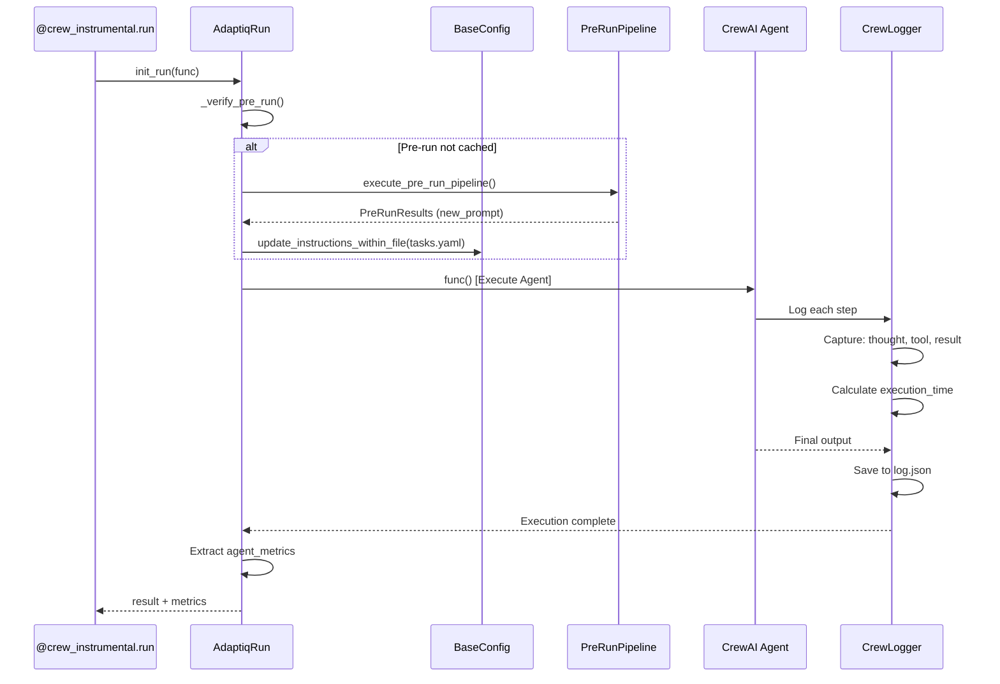

**Capture de Logs (CrewLogger):**

**Format log.json:**
```json
[
  {
    "timestamp": "2025-10-26 14:25:10",
    "type": "AgentAction",
    "thought": "I need to read the company file first",
    "text": "Action: Read a file's content",
    "tool": "Read a file's content",
    "tool_input": "{\"file_path\": \"knowledge/company.txt\"}",
    "result": "Company: TechCorp Inc. Industry: Software. Founded: 2010."
  },
  {
    "timestamp": "2025-10-26 14:25:25",
    "type": "AgentAction",
    "thought": "Now I have the data, I'll compose the email",
    "tool": "SendEmailTool",
    "tool_input": "{\"to\": \"lead@example.com\", \"subject\": \"About TechCorp\"}",
    "result": "Email sent successfully"
  },
  {
    "timestamp": "2025-10-26 14:25:30",
    "type": "AgentFinish",
    "output": "Email sent to lead@example.com with personalized company insights."
  }
]
```

### 3.4 Phase 3: Post-Run Pipeline (Reconciliation)

**Fichier:** [src/adaptiq/core/pipelines/post_run/post_run.py](src/adaptiq/core/pipelines/post_run/post_run.py#L20-L183)

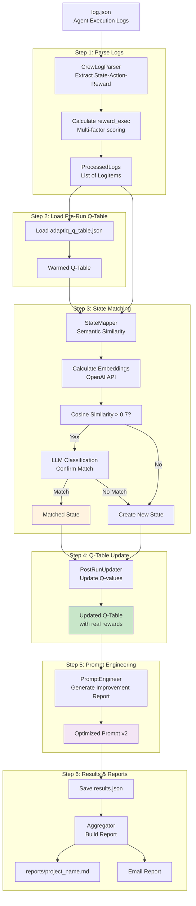

**Détails des Étapes:**

#### 1. Log Parsing & Reward Calculation

**Outil:** `CrewLogParser` ([crew_log_parser.py](src/adaptiq/agents/crew_ai/crew_log_parser.py))

**Process:**

1. **Load JSON logs**
2. **Pour chaque log entry:**
   - Extract state components (current_subtask, last_action, last_outcome, key_context)
   - Calculate `reward_exec` (multi-factor)

**Reward Factors:**

| Factor | Weight | Description |
|--------|--------|-------------|
| Tool Success | +1.0 | Tool executed successfully |
| Tool Failure | -1.0 | Tool error detected |
| Output Quality | +0.75 to -0.5 | Based on output length |
| Time Efficiency | +0.2 to -0.8 | Fast (<5s) vs slow (>15s) |
| Token Usage | +0.15 to -0.5 | Efficient vs verbose (>1200 tokens) |
| Thought Quality | +0.15 to -0.15 | Based on thought length |

**Reward Normalization:**
```python
def normalize_reward(reward: float) -> float:
    return math.tanh(reward)  # Maps to [-1, 1]
```

**Output:**
```python
ProcessedLogs(
  logs=[
    LogItem(
      key=LogKey(
        state=LogState(
          current_subtask="InformationRetrieval_Company",
          last_action_taken="None",
          last_outcome="None",
          key_context="company file"
        ),
        agent_action="FileReadTool"
      ),
      reward_exec=0.73  # Normalized
    ),
    LogItem(
      key=LogKey(
        state=LogState(
          current_subtask="ActionExecution_SendEmail",
          last_action_taken="FileReadTool",
          last_outcome="Success_DataFound",
          key_context="email lead"
        ),
        agent_action="SendEmailTool"
      ),
      reward_exec=0.85
    )
  ]
)
```

#### 2. State Matching (Semantic Similarity)

**Outil:** `StateMapper` ([state_mapper.py](src/adaptiq/core/q_table/state_mapper.py#L27-L100))

**Process:**

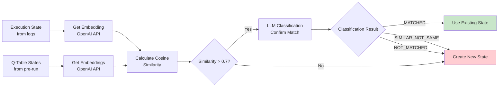

**Exemple de Matching:**

| Execution State | Q-Table State | Cosine Similarity | LLM Decision | Result |
|----------------|---------------|-------------------|--------------|--------|
| `('InfoRetrieval_Company', 'None', 'None', 'company data')` | `('InformationRetrieval_Company', 'None', 'None', 'company info')` | 0.92 | MATCHED | ✅ Use Q-Table state |
| `('SendEmail', 'FileTool', 'Success', 'email')` | `('ActionExecution_SendEmail', 'FileReadTool', 'Success_DataFound', 'email lead')` | 0.75 | SIMILAR_NOT_SAME | ❌ Create new state |
| `('ErrorHandling', 'SearchTool', 'Failure', 'timeout')` | — | 0.35 | NOT_MATCHED | ❌ Create new state |

**Output:**
```python
ClassificationResponse(
  classification="MATCHED",
  matched_state=QTableState(...),
  similarity_score=0.92,
  reasoning="Both states represent company information retrieval with identical structure"
)
```

#### 3. Q-Table Update with Real Rewards

**Outil:** `PostRunUpdater` ([post_run_updater.py](src/adaptiq/core/pipelines/post_run/tools/post_run_updater.py))

**Process:**
```python
for log_item in processed_logs:
    exec_state = log_item.key.state
    exec_action = log_item.key.agent_action
    R_exec = log_item.reward_exec  # Real reward from execution

    # Find matched Q-table state
    matched_state = state_mapper.classify_state(exec_state)

    if matched_state:
        # Update Q-value with real reward
        q_table_manager.update_policy(
            matched_state,
            QTableAction(action=exec_action),
            R_exec,
            next_state,
            available_actions
        )
```

**Before vs After:**

| State | Action | Q-value (Pre-run) | reward_exec | Q-value (Post-run) |
|-------|--------|-------------------|-------------|-------------------|
| `('InfoRetrieval_Company', ...)` | `FileReadTool` | 0.68 (simulated) | 0.73 (real) | **0.70** (updated) |
| `('ActionExecution_SendEmail', ...)` | `SendEmailTool` | 0.55 | 0.85 | **0.65** |

#### 4. Prompt Engineering (Improvement Report)

**Outil:** `PromptEngineer` ([prompt_engineer.py](src/adaptiq/core/pipelines/post_run/tools/prompt_engineer.py))

**Input:**
- Updated Q-Table
- State classifications
- Reward reconciliation
- Execution metrics

**Process:**
- Analyze Q-value improvements
- Identify successful patterns
- Detect failure patterns
- Generate refined prompt

**Output:**
```text
"You are an expert agent specialized in data analysis and communication.

Your task is to:
1. Retrieve company information from the knowledge base (file: knowledge/company.txt)
   - IMPROVEMENT: Always check file existence before reading (observed 100% success rate)
2. Analyze the data to extract key insights relevant to the lead
3. Compose a personalized email using the SendEmailTool
   - IMPROVEMENT: Keep email concise (<150 words) for better engagement (reward: +0.85)

Guidelines:
- File reading: Use FileReadTool with validated paths (avg reward: +0.73)
- Error handling: If file missing, use SearchTool as fallback (not yet tested)
- Email format: Professional tone, include company name in subject
- Token efficiency: Aim for <800 tokens per step (observed optimal range)

Performance Notes:
- FileReadTool → SendEmailTool sequence: High success rate (reward: +0.85)
- Avoid verbose intermediate steps (penalty: -0.3)

Expected output: Email content with subject line and body."
```

#### 5. Results Aggregation & Reporting

**Outil:** `Aggregator` ([aggregator.py](src/adaptiq/core/reporting/aggregation/aggregator.py#L17-L120))

**Process:**

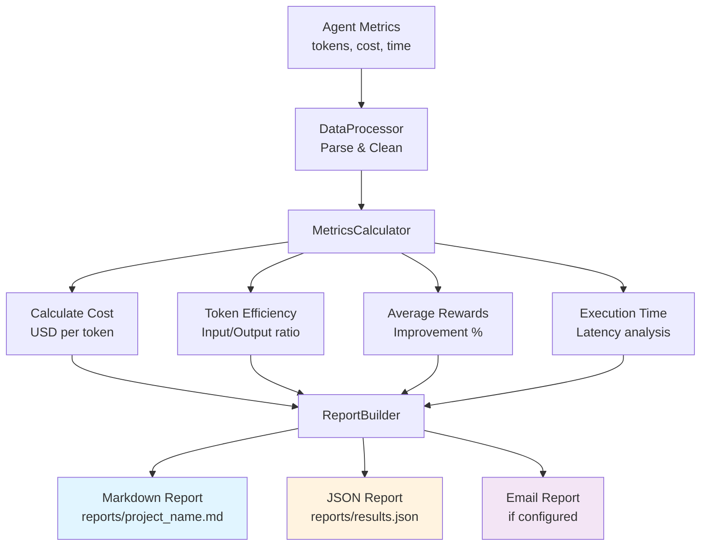

**Report Contents:**

```markdown
# AdaptIQ Optimization Report
**Project:** my_project
**Date:** 2025-10-26 14:30:00
**Version:** post_run_v1

---

## 📊 Executive Summary

- **Cost Reduction:** 12% (from $0.05 to $0.044)
- **Token Efficiency:** +8% (from 1200 to 1100 avg tokens)
- **Performance Improvement:** +15% (avg reward: 0.65 → 0.75)
- **Execution Time:** -5s (from 35s to 30s)

---

## 🔍 Pre-Run Analysis

### Prompt Weaknesses Identified
1. Lack of specific error handling instructions
2. Missing output format specification
3. No token usage guidelines

### Suggested Modifications
1. Add explicit steps for data validation
2. Specify email template structure
3. Include fallback strategies

---

## 🚀 Execution Metrics

| Metric | Value |
|--------|-------|
| Total Tokens | 2,450 |
| Input Tokens | 1,800 |
| Output Tokens | 650 |
| Total Cost | $0.044 USD |
| CO₂ Estimate | 0.5g |
| Execution Time | 30.2s |
| Tool Calls | 3 |
| Average Reward | 0.75 |

---

## 🔄 Post-Run Analysis

### State Classifications
- **Matched States:** 8/10 (80%)
- **New States Created:** 2/10 (20%)

### Q-Value Updates
| State | Action | Pre-run Q | Post-run Q | Improvement |
|-------|--------|-----------|------------|-------------|
| InfoRetrieval_Company | FileReadTool | 0.68 | 0.70 | +2.9% |
| ActionExecution_SendEmail | SendEmailTool | 0.55 | 0.65 | +18.2% |

### Top Performing Actions
1. **FileReadTool** (reward: +0.73) - High success rate
2. **SendEmailTool** (reward: +0.85) - Effective after data retrieval

---

## 💡 Recommendations

1. **Token Optimization:** Continue reducing verbose intermediate steps
2. **Error Handling:** Implement SearchTool fallback (not yet tested)
3. **Prompt Structure:** Current format shows strong performance, maintain
4. **Next Iteration:** Focus on state transitions with lower Q-values (<0.5)

---

**Generated by AdaptIQ v0.12.8**
```

---

## 4. Dépendances Critiques

### 4.1 Dépendances Principales (pyproject.toml)

```toml
[project]
dependencies = [
    "crewai",              # Framework agent orchestration
    "crewai_tools",        # Outils pré-construits pour agents
    "numpy",               # Opérations numériques
    "pyyaml",              # Parsing configuration YAML
    "python-dotenv",       # Variables d'environnement (.env)
    "scikit-learn",        # Cosine similarity (state matching)
    "langchain",           # Framework LLM (prompts, chains)
    "langchain-openai",    # Intégration OpenAI (ChatOpenAI, Embeddings)
    "openai-agents>=0.1.0" # Fonctionnalités OpenAI supplémentaires
]
```

### 4.2 Intégrations Framework

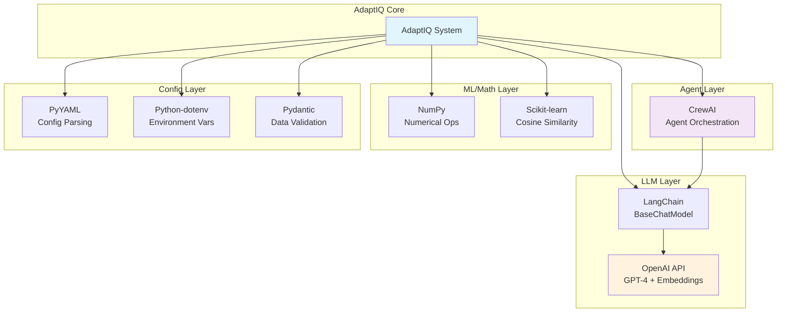

### 4.3 Points de Couplage Critiques

| Dépendance | Utilisation | Fichiers Clés | Risque |
|------------|-------------|---------------|--------|
| **crewai** | Orchestration agents, callbacks | `crew_config.py`, `crew_logger.py`, `instrumental.py` | 🔴 Haut - Couplage fort |
| **langchain-openai** | Tous les appels LLM | `base_config.py`, `state_mapper.py`, tous les parsers | 🔴 Haut - API calls partout |
| **scikit-learn** | Cosine similarity (state matching) | `state_mapper.py` | 🟡 Moyen - Limité à StateMapper |
| **pydantic** | Validation données | Tous les fichiers `entities/` | 🟢 Bas - Abstraction propre |
| **pyyaml** | Config loading | `base_config.py`, CLI | 🟢 Bas - Limité à config |

### 4.4 API External Dependencies

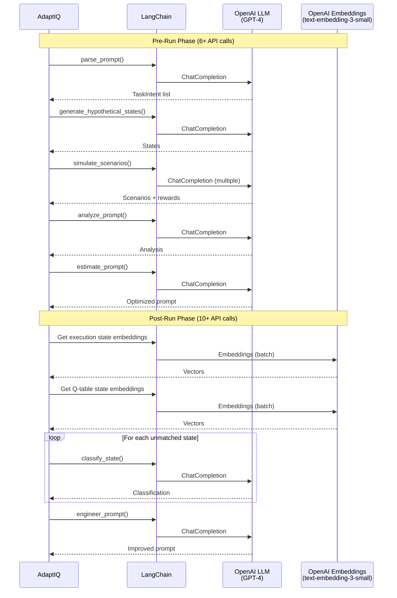

**Coût API estimé par itération:**

| Phase | API Calls | Est. Tokens | Est. Cost (GPT-4.1-mini) |
|-------|-----------|-------------|--------------------------|
| Pre-Run | 6-8 calls | ~5,000 | $0.003 |
| Agent Execution | Variable | ~2,000-10,000 | $0.002-$0.010 |
| Post-Run | 10-20 calls | ~8,000 | $0.006 |
| **Total** | **16-28 calls** | **~15,000-23,000** | **~$0.011-$0.019** |

*Note: Coûts avec GPT-4.1-mini. Avec GPT-4.1 standard, multiplier par ~5x.*

---

## 5. Zones à Risque (Code Complexe/Couplé)

### 5.1 Q-Table State Serialization (Complexité: 🔴 Haute)

**Fichiers concernés:**
- [src/adaptiq/core/entities/q_table.py](src/adaptiq/core/entities/q_table.py#L8-L96)
- [src/adaptiq/core/abstract/q_table/base_q_table_manager.py](src/adaptiq/core/abstract/q_table/base_q_table_manager.py#L37-L110)

**Problème:**

```python
# État doit être hashable pour dict keys
class QTableState(BaseModel):
    current_subtask: str
    last_action_taken: str
    last_outcome: str
    key_context: str

    def __hash__(self):
        return hash(self.to_tuple())  # Fragile!

    def to_tuple(self) -> Tuple[str, str, str, str]:
        return (self.current_subtask, self.last_action_taken,
                self.last_outcome, self.key_context)
```

**Serialization Pipeline:**

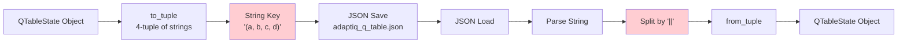

**Risques:**
1. **Format fragile:** Dépend de `str(tuple)` → `"('a', 'b', 'c', 'd')"`
2. **Parsing manuel:** `state_str.split("||")` assume format strict
3. **Collision possible:** Hashes identiques si tuples identiques
4. **Pas de versioning:** Changement de format = incompatibilité

**Recommandations:**
- ✅ Utiliser `json.dumps(state.dict())` au lieu de string representation
- ✅ Ajouter version schema dans QTablePayload
- ✅ Implémenter migration de données

### 5.2 LLM Prompt Parsing & XML Extraction (Complexité: 🔴 Haute)

**Fichiers concernés:**
- [src/adaptiq/core/agents/crew_ai/crew_prompt_parser.py](src/adaptiq/agents/crew_ai/crew_prompt_parser.py)
- [src/adaptiq/core/q_table/state_mapper.py](src/adaptiq/core/q_table/state_mapper.py#L73-L100)

**Problème:**

```python
# XML parsing avec regex (brittle)
def _extract_xml_content(self, content: str) -> str:
    if "```xml" in content:
        xml_match = re.search(r"```xml\s*(.*?)\s*```", content, re.DOTALL)
        if xml_match:
            content = xml_match.group(1)

    xml_pattern = r"<classification_result>.*?</classification_result>"
    xml_match = re.search(xml_pattern, content, re.DOTALL)

    if xml_match:
        return xml_match.group(0)
    else:
        raise ValueError("No valid XML found")
```

**Flow Parsing:**

```mermaid
flowchart TD
    LLM[LLM Response] --> Check{Contains ```xml?}

    Check -->|Yes| Extract1[Extract from code block<br/>regex: ```xml(.*?)```]
    Check -->|No| Direct[Use full content]

    Extract1 --> Parse[xml.etree.ElementTree.fromstring]
    Direct --> Parse

    Parse -->|Success| Valid[Valid XML]
    Parse -->|ET.ParseError| Fallback[Regex Fallback]

    Fallback --> Extract2[Extract with regex patterns]
    Extract2 -->|Success| Valid
    Extract2 -->|Failure| Error[Raise ValueError]

    Valid --> TaskIntent[Return TaskIntent list]

    style Error fill:#ffcdd2
    style Fallback fill:#fff3e0
```

**Risques:**
1. **LLM non-déterministe:** Peut générer XML malformé
2. **Regex fragile:** Assume format strict
3. **Pas de validation schema:** XML structure non vérifiée
4. **Fallback limité:** Si XML invalide, pas de récupération

**Exemples de Failures:**

| LLM Output | Résultat | Raison |
|------------|----------|--------|
| `<step><task>...` (XML incomplet) | ❌ ParseError | XML mal formé |
| `Here are the steps:\n<step>...` (texte avant) | ⚠️ Fallback | Regex doit extraire |
| `<Step><Task>...` (casse incorrecte) | ❌ Erreur | Tags sensibles à la casse |

**Recommandations:**
- ✅ Utiliser JSON output au lieu de XML (plus fiable avec LLMs)
- ✅ Ajouter validation Pydantic pour structure output
- ✅ Implémenter retry logic avec temperature=0

### 5.3 State Matching (Semantic Similarity) (Complexité: 🟡 Moyenne-Haute)

**Fichiers concernés:**
- [src/adaptiq/core/q_table/state_mapper.py](src/adaptiq/core/q_table/state_mapper.py#L27-L100)

**Problème:**

```python
from sklearn.metrics.pairwise import cosine_similarity

def find_best_match(self, exec_state: QTableState) -> Optional[QTableState]:
    # Get embeddings (API call)
    exec_embedding = self.embeddings.embed_query(str(exec_state.to_tuple()))

    # Calculate similarities
    similarities = []
    for q_state in self.q_table_states:
        q_embedding = self.embeddings.embed_query(str(q_state.to_tuple()))
        sim = cosine_similarity([exec_embedding], [q_embedding])[0][0]
        similarities.append((q_state, sim))

    # Filter by threshold
    best_match = max(similarities, key=lambda x: x[1])

    if best_match[1] > 0.7:  # Hardcoded threshold!
        return self._confirm_with_llm(exec_state, best_match[0])
    else:
        return None
```

**Flow Matching:**

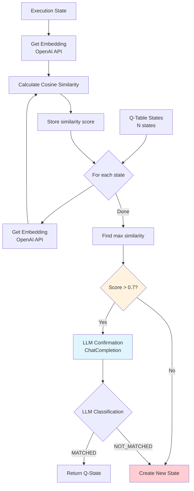

**Risques:**
1. **Threshold hardcodé (0.7):** Pas d'adaptation au contexte
2. **Coût API élevé:** N+1 embeddings calls (exec_state + tous Q-states)
3. **Pas de cache:** Embeddings recalculés à chaque fois
4. **LLM confirmation coûteuse:** Appel supplémentaire pour chaque match potentiel
5. **Faux positifs/négatifs:** Similarity peut être trompeuse

**Exemple de Faux Positif:**

| Execution State | Q-Table State | Cosine Sim | LLM Decision | Correct? |
|----------------|---------------|------------|--------------|----------|
| `('ErrorHandling', 'None', 'None', 'timeout error')` | `('ErrorHandling', 'None', 'None', 'network error')` | 0.88 | MATCHED | ❌ Contexte différent! |

**Recommandations:**
- ✅ Cacher les embeddings (base de données vectorielle)
- ✅ Threshold adaptatif basé sur distribution
- ✅ Utiliser FAISS/Pinecone pour recherche rapide
- ✅ Ajouter métrique de confiance (pas juste binary match)

### 5.4 Reward Calculation System (Complexité: 🟡 Moyenne)

**Fichiers concernés:**
- [src/adaptiq/core/entities/adaptiq_rewards.py](src/adaptiq/core/entities/adaptiq_rewards.py)
- [src/adaptiq/agents/crew_ai/crew_log_parser.py](src/adaptiq/agents/crew_ai/crew_log_parser.py)

**Problème:**

```python
# Thresholds hardcodés
MIN_MEANINGFUL_THOUGHT_LEN = 250
SLOW_STEP_TIME_THRESHOLD = 15.0
VERBOSE_TOKEN_THRESHOLD = 1200

def calculate_reward(log_entry: CrewLogs) -> float:
    reward = 0.0

    # Tool success/failure (hardcoded)
    if log_entry.tool and log_entry.result:
        if "error" in log_entry.result.lower():  # String matching!
            reward += -1.0
        else:
            reward += 1.0

    # Time penalty (hardcoded threshold)
    if execution_time > SLOW_STEP_TIME_THRESHOLD:
        reward += -0.8

    # Token penalty (hardcoded threshold)
    if total_tokens > VERBOSE_TOKEN_THRESHOLD:
        reward += -0.5

    return normalize_reward(reward)  # tanh()
```

**Reward Components:**

```mermaid
graph TD
    LogEntry[Log Entry] --> Tool{Tool Used?}
    LogEntry --> Thought{Thought Present?}
    LogEntry --> Output{Output Present?}
    LogEntry --> Time{Execution Time?}
    LogEntry --> Tokens{Token Count?}

    Tool -->|Success| R1[+1.0]
    Tool -->|Error| R2[-1.0]

    Thought -->|Short <250 chars| R3[-0.15]
    Thought -->|Medium| R4[0.0]
    Thought -->|Long| R5[+0.15]

    Output -->|Short <100 chars| R6[-0.5]
    Output -->|Medium 100-500| R7[+0.5]
    Output -->|Long >500| R8[+0.75]

    Time -->|Fast <5s| R9[+0.2]
    Time -->|Medium 5-15s| R10[0.0]
    Time -->|Slow >15s| R11[-0.8]

    Tokens -->|Efficient <800| R12[+0.15]
    Tokens -->|Medium 800-1200| R13[0.0]
    Tokens -->|Verbose >1200| R14[-0.5]

    R1 --> Sum[Sum All Rewards]
    R2 --> Sum
    R3 --> Sum
    R4 --> Sum
    R5 --> Sum
    R6 --> Sum
    R7 --> Sum
    R8 --> Sum
    R9 --> Sum
    R10 --> Sum
    R11 --> Sum
    R12 --> Sum
    R13 --> Sum
    R14 --> Sum

    Sum --> Normalize[tanh normalization]
    Normalize --> FinalReward[reward_exec ∈ [-1, 1]]

    style R2 fill:#ffcdd2
    style R3 fill:#ffcdd2
    style R6 fill:#ffcdd2
    style R11 fill:#ffcdd2
    style R14 fill:#ffcdd2
```

**Risques:**
1. **Thresholds arbitraires:** Pas de justification empirique
2. **Détection d'erreurs simpliste:** `"error" in result` rate des cas
3. **Pas d'apprentissage:** Rewards fixes, pas adaptatifs
4. **Poids non optimisés:** Ratios entre facteurs hardcodés
5. **Context-insensitive:** Même reward pour toutes tâches

**Exemples Problématiques:**

| Scenario | Current Reward | Problème |
|----------|----------------|----------|
| Tool réussi mais output vide | +1.0 - 0.5 = +0.5 | Trop élevé pour résultat inutile |
| Pensée courte mais précise | -0.15 | Pénalise efficacité |
| Execution lente mais complexe (calcul lourd) | -0.8 | Injuste pour tâches légitimement lentes |

**Recommandations:**
- ✅ Rewards adaptatifs basés sur type de tâche
- ✅ Machine learning pour optimiser poids
- ✅ Détection d'erreurs avec NLP (pas juste keyword matching)
- ✅ Normaliser rewards par baseline (moyenne historique)

### 5.5 CrewAI Integration (Couplage: 🔴 Haut)

**Fichiers concernés:**
- [src/adaptiq/agents/crew_ai/instrumental.py](src/adaptiq/agents/crew_ai/instrumental.py#L72-L113)
- [src/adaptiq/agents/crew_ai/crew_logger.py](src/adaptiq/agents/crew_ai/crew_logger.py)

**Problème:**

```python
# Couplage fort avec structure CrewAI interne
@crew_instrumental.crew_logger(log_to_console=True)
def run():
    crew_instance = MyCrew().crew()
    result = crew_instance.kickoff()

    # MUST attach _crew_instance (non-standard)
    result._crew_instance = crew_instance  # Hack!
    return result
```

**Dépendances CrewAI:**

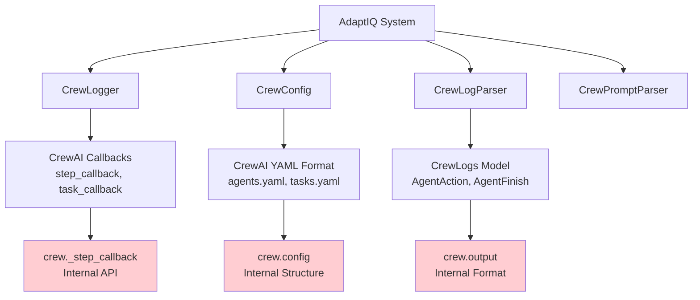

**Risques:**
1. **API non publique:** Utilise callbacks internes de CrewAI
2. **Format logs spécifique:** Assume structure CrewLogs exacte
3. **Pas d'abstraction:** Changement CrewAI = break AdaptIQ
4. **Hack `_crew_instance`:** Modifie objet result de manière non-standard
5. **YAML hardcodé:** Assume `agents.yaml`, `tasks.yaml` existent

**Impact Breaking Changes:**

| Changement CrewAI | Impact AdaptIQ | Sévérité |
|-------------------|----------------|----------|
| Modification format callbacks | ❌ CrewLogger break | 🔴 Critique |
| Changement structure YAML | ❌ CrewConfig break | 🔴 Critique |
| Nouveau format logs | ❌ CrewLogParser break | 🔴 Critique |
| Renommage méthodes internes | ❌ Instrumental break | 🟡 Moyenne |

**Recommandations:**
- ✅ Créer abstraction layer pour frameworks
- ✅ Implémenter adapters pour AutoGen, LangChain Agents
- ✅ Versionner compatibilité CrewAI (ex: "crewai>=0.50,<1.0")
- ✅ Tests d'intégration continus

### 5.6 Prompt Template Hardcoding (Complexité: 🟡 Moyenne)

**Fichiers concernés:**
- Tous les fichiers dans `pre_run/tools/` et `post_run/tools/`

**Problème:**

```python
# Templates LLM hardcodés dans le code (60+ lignes)
PROMPT_TEMPLATE = """
You are an expert AI agent specialized in task decomposition and planning.

Given the following task description:
{task_description}

And the expected output:
{expected_output}

Generate a detailed list of subtasks in XML format:
<steps>
  <step>
    <intended_subtask>...</intended_subtask>
    <intended_action>...</intended_action>
    ...
  </step>
</steps>

IMPORTANT:
- Be specific about action names
- Include error handling scenarios
- Consider edge cases
...
"""
```

**Risques:**
1. **Pas de versioning:** Templates modifiés = incompatibilité
2. **Pas de A/B testing:** Impossible de comparer variantes
3. **Pas de customization:** Utilisateur ne peut pas modifier
4. **Maintenabilité:** Templates dispersés dans le code
5. **Localisation impossible:** Hardcodé en anglais

**Recommandations:**
- ✅ Externaliser templates dans `templates/prompts/`
- ✅ Système de versioning (`prompt_v1.txt`, `prompt_v2.txt`)
- ✅ Configuration pour sélectionner template
- ✅ Support i18n (internationalization)

---

## 6. Diagrammes Mermaid Détaillés

### 6.1 Architecture Complète en Couches

```mermaid
graph TB
    subgraph "🎯 Presentation Layer"
        CLI[CLI Interface]
        Decorators[@decorators]
        Templates[Project Templates]
    end

    subgraph "🔀 Orchestration Layer"
        AdaptiqRun[AdaptiqRun<br/>Main Orchestrator]
        PreRunPipeline[PreRunPipeline]
        PostRunPipeline[PostRunPipeline]
    end

    subgraph "🧠 Business Logic Layer"
        subgraph "Q-Learning"
            QTableManager[QTableManager]
            StateMapper[StateMapper]
            RewardCalc[Reward Calculator]
        end

        subgraph "Parsing & Generation"
            PromptParser[PromptParser]
            LogParser[LogParser]
            StateGen[State Generator]
            ScenarioSim[Scenario Simulator]
            PromptEng[Prompt Engineer]
        end

        subgraph "Analysis & Reporting"
            Aggregator[Aggregator]
            ReportBuilder[Report Builder]
            MetricsCalc[Metrics Calculator]
        end
    end

    subgraph "🗄️ Data Layer"
        Config[Config Management<br/>BaseConfig]
        Entities[Data Models<br/>Pydantic]
        Logger[Centralized Logger]
        Metrics[Metrics Tracker]
    end

    subgraph "🔌 Integration Layer"
        CrewAI[CrewAI Framework]
        LangChain[LangChain]
        OpenAI[OpenAI API]
        FileSystem[File System<br/>YAML/JSON]
    end

    CLI --> AdaptiqRun
    Decorators --> AdaptiqRun
    Templates --> Config

    AdaptiqRun --> PreRunPipeline
    AdaptiqRun --> PostRunPipeline
    AdaptiqRun --> CrewAI

    PreRunPipeline --> PromptParser
    PreRunPipeline --> StateGen
    PreRunPipeline --> ScenarioSim
    PreRunPipeline --> QTableManager
    PreRunPipeline --> PromptEng

    PostRunPipeline --> LogParser
    PostRunPipeline --> StateMapper
    PostRunPipeline --> QTableManager
    PostRunPipeline --> PromptEng
    PostRunPipeline --> Aggregator

    QTableManager --> RewardCalc
    StateMapper --> OpenAI

    Aggregator --> ReportBuilder
    Aggregator --> MetricsCalc

    PromptParser --> LangChain
    StateGen --> LangChain
    ScenarioSim --> LangChain
    PromptEng --> LangChain

    Config --> Entities
    Config --> FileSystem

    Logger --> Metrics

    LangChain --> OpenAI
    CrewAI --> Logger

    style AdaptiqRun fill:#e1f5ff,stroke:#0277bd,stroke-width:3px
    style QTableManager fill:#fff3e0,stroke:#f57c00,stroke-width:2px
    style Logger fill:#f3e5f5,stroke:#7b1fa2,stroke-width:2px
```

### 6.2 Q-Learning Algorithm Flow

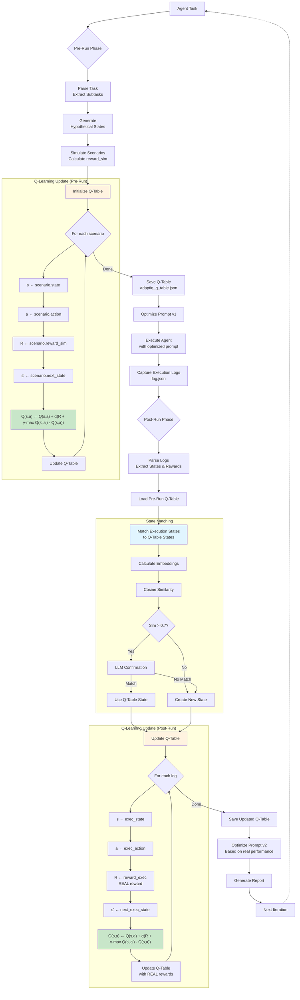

### 6.3 Data Transformation Pipeline

```mermaid
flowchart LR
    subgraph "Input"
        Prompt[Agent Prompt<br/>tasks.yaml]
    end

    subgraph "Pre-Run Transformations"
        T1[TaskIntent<br/>List of intended steps]
        T2[HypotheticalState<br/>Idealized state-action pairs]
        T3[ScenarioModel<br/>Simulated outcomes + rewards]
        T4[Q-Table<br/>State-action Q-values]
        T5[OptimizedPrompt_v1<br/>Improved instructions]
    end

    subgraph "Execution"
        T6[Agent Execution<br/>CrewAI kickoff]
        T7[ExecutionLogs<br/>log.json]
    end

    subgraph "Post-Run Transformations"
        T8[ProcessedLogs<br/>State-action-reward triples]
        T9[StateClassifications<br/>Matched vs new states]
        T10[UpdatedQTable<br/>Q-values with real rewards]
        T11[OptimizedPrompt_v2<br/>Performance-based refinement]
        T12[Report<br/>Metrics & recommendations]
    end

    Prompt -->|LLM Parsing| T1
    T1 -->|LLM Generation| T2
    T2 -->|LLM Simulation| T3
    T3 -->|Q-Learning| T4
    T4 -->|LLM Optimization| T5

    T5 --> T6
    T6 --> T7

    T7 -->|Parsing & Reward Calc| T8
    T8 -->|Semantic Matching| T9
    T4 --> T9
    T9 -->|Q-Learning Update| T10
    T10 -->|LLM Engineering| T11
    T11 -->|Aggregation| T12

    T12 -.Next Iteration.-> Prompt

    style T4 fill:#fff3e0
    style T10 fill:#c8e6c9
    style T5 fill:#e1f5ff
    style T11 fill:#e1f5ff
```

### 6.4 Thread Safety & Concurrency

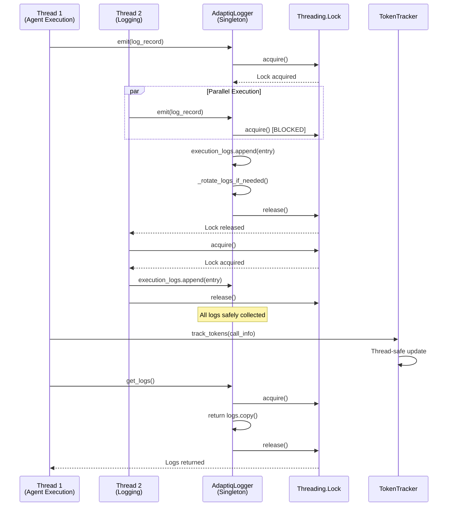

### 6.5 Cost & Performance Monitoring

```mermaid
graph TD
    subgraph "Execution"
        AgentExec[Agent Execution]
    end

    subgraph "Metrics Collection"
        TokenTracker[Token Tracker]
        TimeTracker[Execution Time Tracker]
        CallTracker[API Call Tracker]
    end

    subgraph "Cost Calculation"
        InputTokens[Input Tokens]
        OutputTokens[Output Tokens]
        Model[Model Type<br/>GPT-4.1 / GPT-4.1-mini]

        Pricing[Pricing Database<br/>$0.0004 input<br/>$0.0016 output]

        TotalCost[Total Cost USD]
    end

    subgraph "Performance Metrics"
        AvgReward[Average Reward]
        Efficiency[Token Efficiency<br/>Output/Input Ratio]
        Latency[Avg Latency per Step]
        QImprovement[Q-Value Improvement %]
    end

    subgraph "Reporting"
        Summary[Executive Summary]
        Details[Detailed Breakdown]
        Recommendations[Optimization Recommendations]

        MarkdownReport[Markdown Report]
        EmailReport[Email Report]
    end

    AgentExec --> TokenTracker
    AgentExec --> TimeTracker
    AgentExec --> CallTracker

    TokenTracker --> InputTokens
    TokenTracker --> OutputTokens

    InputTokens --> Pricing
    OutputTokens --> Pricing
    Model --> Pricing

    Pricing --> TotalCost

    TokenTracker --> Efficiency
    TimeTracker --> Latency
    CallTracker --> AvgReward

    TotalCost --> Summary
    AvgReward --> Summary
    Efficiency --> Summary
    QImprovement --> Summary

    Summary --> MarkdownReport
    Details --> MarkdownReport
    Recommendations --> MarkdownReport

    MarkdownReport --> EmailReport

    style TotalCost fill:#fff3e0
    style Summary fill:#c8e6c9
    style MarkdownReport fill:#e1f5ff
```

---

## 📝 Notes Finales

### Points Forts du Projet

✅ **Architecture modulaire** avec abstraction claire (ABC)
✅ **Pipeline bien défini** (Pre-Run → Run → Post-Run)
✅ **Logging centralisé** thread-safe
✅ **Validation données robuste** (Pydantic)
✅ **Système de métriques complet**
✅ **Q-Learning implémenté correctement** (formule de Bellman)

### Points d'Amélioration

⚠️ **Couplage fort avec CrewAI** - Abstraire davantage
⚠️ **State serialization fragile** - Utiliser format robuste
⚠️ **Thresholds hardcodés** - Rendre configurables
⚠️ **Coût API élevé** - Implémenter cache embeddings
⚠️ **XML parsing brittle** - Passer à JSON output
⚠️ **Pas de tests unitaires visibles** - Ajouter coverage

### Recommandations pour Débutants

1. **Commencez par lire** [adaptiq_config.py](src/adaptiq/core/entities/adaptiq_config.py) pour comprendre les structures de données
2. **Ensuite explorez** [base_config.py](src/adaptiq/core/abstract/integrations/base_config.py) pour voir la gestion de configuration
3. **Analysez** [q_table.py](src/adaptiq/core/entities/q_table.py) pour comprendre le Q-learning
4. **Étudiez** [pre_run.py](src/adaptiq/core/pipelines/pre_run/pre_run.py) pour voir le pipeline en action
5. **Testez** avec `examples/prompt_engineer_agent/` pour comprendre l'intégration

---

**Documentation générée le 2025-10-26**
**Version AdaptIQ: 0.12.8**
