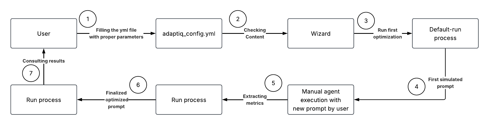
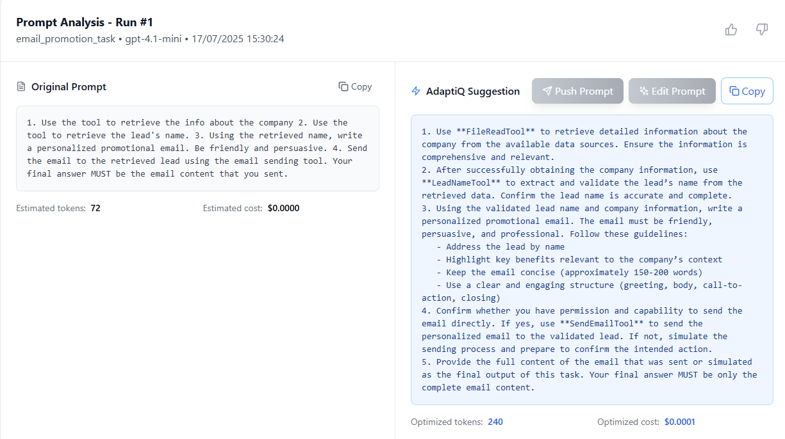

# AdaptIQ — Adaptive Optimization Framework for AI Agents

[](https://www.python.org/)
[](https://pypi.org/project/adaptiq)
[](#benchmarks--methodology)
[](#benchmarks--methodology)
[](LICENSE)
[](https://benchmyagent.com)

**AdaptIQ — Adaptive Optimization Framework for AI Agents – Optimize behaviors, reduce resource usage, and accelerate learning with low-cognitive reinforcement tuning.**

---


## 🚀 Quick Overview

AdaptIQ uses reinforcement learning to automatically optimize your AI agents. Point it at your agent's logs, and it learns which actions work best in different situations, reducing costs by 30% while improving performance.

**Key Benefits:** Lower costs, better performance, data-driven optimization  
**Current Support:** CrewAI (only supported framework) + OpenAI (more coming soon)

---

## 📋 Table of Contents
1. [🤔 Why AdaptiQ?](#-why-adaptiq)
2. [⚡ Quick Start](#-quick-start)
3. [✨ Features](#-features)
4. [🧠 How It Works (RL + Q-table)](#-how-it-works-rl--q-table)
5. [🏗️ Architecture](#️-architecture)
6. [📊 Reporting Mode](#-reporting-mode)
7. [🖼️ AdaptIQ Image Generation Benchmark](#️-adaptiq-image-generation-benchmark)
8. [🔮 What's Next](#-whats-next)
9. [☁️ Upgrade Path → AdaptiQ FinOps Cloud](#️-upgrade-path--adaptiq-finops-cloud)
10. [🤝 Community & Contributing](#-community--contributing)
11. [📄 License](#-license)

---

## 🤔 Why AdaptiQ?

AdaptIQ addresses the critical challenge of optimizing AI agent performance through intelligent, data-driven approaches. Our framework transforms the traditionally manual and error-prone process of agent tuning into a systematic, reinforcement learning-powered optimization workflow that learns from execution patterns and continuously improves agent behavior while reducing costs and resource consumption.

| Pain point | Traditional workaround | **AdaptiQ advantage** |
|------------|-----------------------|-----------------------|
| Prompt/agent errors discovered **after** expensive runs | Manual review, trial‑and‑error | Detects & fixes issues **before** execution |
| GPU/LLM cost spikes | Spreadsheet audits | Predicts € & CO₂ inline |
| No common prompt style | Word/PDF guidelines | Enforced by lint rules, autofixable |
| Dev ↔ FinOps gap | Slack + e‑mails | Same CLI / dashboard for both teams |

---

## ⚡ Quick Start

### 📋 Prerequisites

Before installing AdaptIQ, ensure you have:

- **Python 3.12+** - Required for AdaptIQ framework
- **CrewAI framework** - Set up and configured for your agents (only supported framework)
- **OpenAI API key** - For LLM provider access
- **Windows OS Linux and Mac** 

### 📦 Installation

First, install UV package manager:

```bash
# Windows (PowerShell)
powershell -ExecutionPolicy ByPass -c "irm https://astral.sh/uv/install.ps1 | iex"
```

> ⚠️ **Note**: Linux and Mac support is not tested yet. We recommend using Windows for now.

Then activate your virtual environment and install AdaptIQ:

```bash
uv pip install adaptiq
```

For development mode:
```bash
uv pip install -e .
```

### 🪄 Quick Setup

**Initialize a new project:**

```bash
adaptiq init --name name_project --template framework_template --path ./my_project
```

> 📝 **Note**: Only **CrewAI** is supported as the framework template currently.

This will initialize a project with `adaptiq_config.yml` that you should configure.

### 🔧 Configuration Validation

**Validate your configuration:**
```bash
adaptiq validate --config_path adaptiq_yml_path --template framework_template
```

### 🎮 Running AdaptIQ

AdaptIQ will run the optimization process automatically once the agent is in execution.

> 📝 **Important**: AdaptIQ currently supports only **CrewAI** as the agentic framework, **OpenAI** as the provider, and **GPT-4.1** and **GPT-4.1-mini** as the LLMs for the workflow. Other models and frameworks have not been tested yet.

---

## ✨ Features

| Category | Free | Cloud (SaaS) |
|----------|------|--------------|
| 🧙 YAML validation | ✅ | ✅ |
| 🔍 Prompt & agent lint rules | ✅ | ✅ |
| 💰 **Pre‑run cost** | ✅ | ✅ |
| 🤖 RL‑powered optimisation suggestions | ✅ | ✅ |
| 🏭 Automatic optimisation at scale | — | ✅ |
| 💚 GPU‑spot arbitrage, ESG ledger | — | ✅ |
| 📊 Multi‑tenant FinOps dashboard | — | ✅ |

---

## 🧠 How It Works (RL + Q-table)

### 🎯 ADAPTIQ - Agent Development & Prompt Tuning Iteratively with Q-Learning

ADAPTIQ is a framework designed for the iterative improvement of AI agent performance through offline Reinforcement Learning (RL). Its primary goal is to systematically enhance an agent's guiding Configuration, focusing mainly on its Task Description (Prompt), by learning from the agent's past execution behaviors and incorporating user validation. It provides a structured, data-driven alternative to purely manual prompt engineering.

### 🚀 Vision and Goal

Adaptiq's mission is to optimize agent behavior by refining its core instructions (prompts/task descriptions). It achieves this by analyzing what an agent intended to do (from its prompt), what it actually did (from execution logs), and how effective those actions were (via a multi-faceted reward system). It is especially suited for agents using frameworks like CrewAI, LangChain, etc., where direct, real-time RL control is often impractical.

### 🔧 Key Concepts in Adaptiq

#### 🧩 State (s)
Represents the agent's situation at a specific step, defined by features like:

- **Current_SubTask**: The immediate objective
- **Last_Action_Taken**: The previous validated ARIC strategic action
- **Last_Outcome**: The validated result of the previous action
- **Key_Context**: Accumulated relevant information (validated flags/data)

States are transformed into consistent, hashable representations for Q-table storage, potentially using generalization techniques.

#### 🎯 Action (a)
A selection from a predefined menu of discrete, strategic actions (e.g., Use_Tool_X, Action_Write_Content). Adaptiq maps observed log events to these predefined actions.

#### 📊 Q-Table
The core knowledge base: `Q(state_representation, action) → value`. It stores the learned long-term value of taking an action in a specific state, refined through the Adaptiq loop.

#### 🏆 Reward (R)
Calculated offline during/after trace reconciliation. It incorporates:

- **Plan Adherence**: How well the actual execution matched the intended plan from prompt parsing
- **Execution Success (R_execution/internal)**: Based on tool outcomes, task progress, constraint adherence, and output quality from the logs
- **External Feedback (R_external - Optional)**: Real-world impact metrics (e.g., email open rates, conversions). To be implemented soon (now as external feedback only human feedback of user's evaluation of the agent after adaptiq optimization)

### 🛠️ Trace Analysis & Reconciliation Strategy

Adaptiq employs a multi-stage approach:

1. **Prompt Parsing**: An LLM-powered module analyzes the agent's task description to extract the intended sequence of sub-tasks and actions

2. **Hypothetical State Generation**: Uses the prompt parser's output to define idealized states and actions for heuristic Q-table initialization

3. **Log Parsing**: Module parses raw execution logs to identify actual agent thoughts, tool calls, and outcomes

4. **Reconciliation**: A central facilitates the alignment of the intended plan with actual execution. It allows the user to:
   - Validate/correct inferred states and actions
   - Confirm/override calculated rewards
   - Refine the understanding of the agent's behavior
   
   This produces the mapping data.

**Lightweight Q‑table examples:**

| State | Action | Q‑value |
|-------|--------|---------|
| `('InformationRetrieval_Company', 'None', 'None', 'company info')` | FileReadTool | **0.6** |
| `('InformationRetrieval_Lead', 'FileReadTool', 'Success_DataFound', 'company info lead name')` | LeadNameTool | **0.7** |
| `('ActionExecution_SendEmail', 'Write_Email_Body', 'Success_ActionCompleted', 'email sent lead')` | SendEmailTool | **0.7** |
| `('ResultFinalization', 'SendEmailTool', 'Success_ActionCompleted', 'email content final answer')` | Formulate_Final_Answer | **0.8** |

---

## 🏗️ Architecture



---

## 📊 Reporting Mode

AdaptIQ offers flexible reporting options:

### 💾 Local Reporting
- Save optimization reports locally as Markdown
- Detailed performance metrics and recommendations
- Offline analysis capabilities

### 📧 Email Reports
- Send comprehensive reports to your email
- URL-based report sharing
- Real-time optimization insights (multiple)

> 📝 **Privacy Note**: When you provide your email in the YAML config, you acknowledge that we can process your data according to our privacy policy.




## 🖼️ AdaptIQ Image Generation Benchmark

The **AdaptIQ Image Generation Benchmark** is a comprehensive evaluation suite designed to measure and optimize image generation agents using reinforcement learning. This benchmark demonstrates AdaptIQ's effectiveness in reducing costs while maintaining quality across creative AI tasks.

### 🎯 Benchmark Overview

Given target synthetic images, agents must reproduce them with maximum fidelity at minimum cost. Our benchmark uses a paired design comparing baseline CrewAI + GPT-4.1 agents against AdaptIQ-optimized versions using the same technology stack enhanced with runtime RL optimization.

### 📊 Current Results

| Metric | Baseline | AdaptIQ | Improvement | p-value |
|--------|----------|---------|-------------|---------|
| **Latency (s)** | 13.94 | 11.85 | **-15.0%** | < 0.001 |
| **Cost (USD/img)** | 0.0099 | 0.0086 | **-13.6%** | < 0.001 |
| **Tokens (count)** | 8347 | 7459 | **-10.6%** | 0.366 (ns) |
| **Quality (CLIP)** | 91.18 | 91.01 | -0.17 | target ≥ 0 |
| **Efficiency Score** | 658.87 | 895.44 | **+35.9%** | - |

### 🔧 Technical Implementation

- **Models**: OpenAI GPT-4.1 + FLUX-1.1-pro (image generation)
- **Quality Metric**: CLIP ViT-B/32 similarity scoring
- **Test Images**: Curated dataset from Pinterest (research use)
- **RL Architecture**: Q-learning with state-action optimization

### 📈 Key Achievements

- **Cost Reduction**: 13.6% savings per image generation
- **Speed Improvement**: 15% faster execution with 2.09s average reduction
- **Stability**: 2.8× lower token usage variance for predictable performance
- **Quality Preservation**: Near-parity quality with minimal CLIP score difference

**Check out our benchmark repository:** [https://github.com/adaptiq-ai/adaptiq-benchmark](https://github.com/adaptiq-ai/adaptiq-benchmark)

> 📝 **Note**: Additional benchmarks for RAG systems, coding agents, knowledge graphs, and other optimization capabilities will be added as new features are implemented.

---

## 🔮 What's Next

### 🎯 Upcoming Features

- **🔄 Support for More Models and Providers**: Expanding compatibility beyond OpenAI to include other LLM providers and models
- **🔄 Context Engineering Optimization**: Advanced prompt and context management through Q-learning
  - **📝 Prompt Optimization Workflow**: Implementing external rewards data type and tool tracking and evaluation
  - **📚 Q-Table Strategy for RAG Systems**: Learn which effective chunks reduce cost and increase speed
  - **💻 Coding Agent Enhancement**: Enhancing coding capabilities by using Q-learning for code generation patterns, debugging workflows, and repository context management
  - **🧠 Memory Layer Integration**: Q-table learns optimal context retention patterns - storing frequently accessed information states and reducing redundant retrievals through intelligent caching strategies
  - **📊 Knowledge Graph Integration**: Dynamic relationship mapping between entities and concepts for contextually-aware agent decisions
  - **🔌 External Context Integration APIs**: Seamless integration with CRM, databases, and third-party tools for enriched contextual understanding
  - **🛡️ Governance & Constraints**: 
    - **🚧 Guardrails**: Q-learning enforced safety boundaries and compliance rules
    - **🔐 Access Control**: Context-aware permission management
    - **📋 Policy Enforcement**: Automated adherence to organizational guidelines and industry standards
- **📱 Q-Table for Edge Devices**: Optimizing AI models performance to work better on resource-constrained devices
- **📊 Additional Benchmarks**: Expanding evaluation coverage with new benchmark suites for text generation, code generation, data analysis, and multi-modal tasks

---

## 🤝 Community & Contributing

We ❤️ PRs: bug fixes, lint rules, language support.  
See [`CONTRIBUTING.md`](./CONTRIBUTING.md).

* 💬 **Discord**: [**#adaptiq**](https://discord.com/invite/tZZUvcSY) (roadmap call 1st Tuesday) 
* 🐦 **X/Twitter**: [@adaptiq_ai](https://x.com/adaptiq_ai)

---

## 🧪 Beta Version Notice

AdaptIQ is currently in **beta version**. We welcome any issues, bug reports, or contributions to improve the framework! Your feedback helps us build a better tool for the AI agent community. 🙏

Please feel free to:
- 🐛 Report bugs via GitHub Issues
- 💡 Suggest new features
- 🤝 Contribute code improvements
- 📝 Improve documentation

Together, we can make AdaptIQ the best optimization framework for AI agents! 🚀

## 📚 Citation

If you use AdaptIQ in your research, project, or commercial application, please cite us:

### 📖 BibTeX

```bibtex
@software{adaptiq2025,
  title={AdaptIQ: Adaptive Optimization Framework for AI Agents},
  author={AdaptIQ AI Team},
  year={2025},
  url={https://github.com/adaptiq-ai/adaptiq},
  note={Adaptive Optimization Framework for AI Agents with Reinforcement Learning}
}
```
### 🔗 MLA Format

AdaptIQ AI Team. "AdaptIQ: Adaptive Optimization Framework for AI Agents." GitHub, 2025, https://github.com/adaptiq-ai/adaptiq.

### 📊 Research Papers

If you publish research using AdaptIQ, we'd love to hear about it! Please:
- 📧 Email us at research@getadaptiq.io
- 🐦 Tag us on Twitter [@adaptiq_ai](https://x.com/adaptiq_ai)
- 💬 Share in our Discord **#research** channel

---

## 📄 License

* **Code**: Apache 2.0 License 🆓
* **RL weights & FinOps Cloud components**: proprietary

© 2025 AdaptiQ AI. All trademarks belong to their respective owners.
